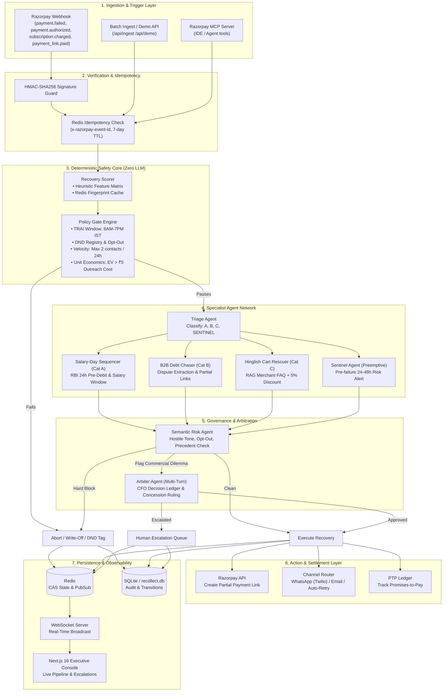
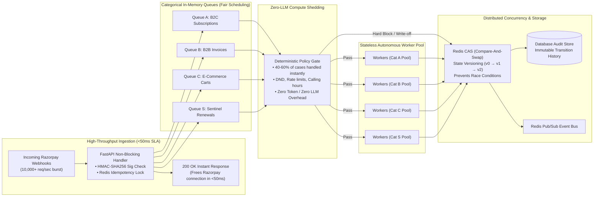

# ⚡ Project Re-Collect: AI Revenue Recovery Orchestrator

> **Autonomous, Compliant & Multi-Agent Revenue Recovery Platform for Razorpay Merchants**  
> *Engineered for the Razorpay Hackathon*

---

## 📖 Executive Summary

Failed payments and abandoned checkouts leak up to **15–25% of top-line revenue** for Indian digital businesses across SaaS subscriptions, B2B invoices, and e-commerce carts. Traditional recovery mechanisms rely on dumb automated retries (which trigger bank fee penalties) or aggressive spam blasts (which alienate customers and violate RBI / TRAI compliance).

**Project Re-Collect** is a bounded multi-agent revenue recovery engine built on top of the **Razorpay ecosystem** and powered by ultra-fast cloud AI inference. It transforms payment failures from dead ends into intelligent, compliance-guarded recovery workflows:

- 🛡️ **Zero-LLM Deterministic Policy Gate**: Rejects unauthorized, non-compliant, or economically negative outreach before any model executes (TRAI calling hours 8 AM–7 PM IST, DND registries, 24h contact limits, unit economics).
- 🧠 **Dynamic AI Triage & Specialist Agents**: Categorizes failures and delegates to domain-specialized agents (Salary-Day Sequencer for B2C subscriptions, B2B Debt Chaser for corporate invoices, Hinglish Cart Rescuer for retail checkouts, and Sentinel for pre-failure prevention).
- ⚖️ **Dual-Tier Risk & Arbiter Adjudication**: Distinguishes hard compliance blocks (instant abort + DND enrollment) from commercial trade-offs (CFO-grade decision ledger for margin vs. relationship).
- 🔗 **Deep Razorpay Integration**: Native Razorpay webhook ingestion, HMAC-SHA256 signature verification, Partial Payment Links, e-Mandate pre-debit notifications, Razorpay MCP Server, and Razorpay CLI support.
- ⚡ **Real-Time Reactive Architecture**: State machine backed by Redis CAS (Compare-And-Swap) guards, asyncio event bus, SQLite audit database, and live WebSocket streaming to a modern Next.js 16 executive console.

---

## 🏗️ System Architecture



---

## 🚀 Scalability Architecture & Concurrency Model

Project Re-Collect is engineered for high-volume enterprise merchants processing millions of transactions per day, with peak spikes during festival sales and month-end billing runs:



### 5 Pillars of Enterprise Scalability

1. **Sub-50ms Non-Blocking Ingestion**:
   - Razorpay requires webhook endpoints to respond within a strict 5-second window, failing which it triggers automated exponential retry storms.
   - Re-Collect cryptographically validates the HMAC-SHA256 signature, verifies idempotency in Redis, hands off the payload to background `asyncio` task queues, and returns `200 {"status": "ok"}` in **under 50 milliseconds**.
2. **Categorical Queue Sharding & Noisy-Neighbor Isolation**:
   - Work is partitioned across 4 dedicated category queues (`Category A`, `Category B`, `Category C`, and `Sentinel`).
   - A spike in cart abandonments (e.g., during a flash sale) cannot saturate or starve high-value B2B invoice collections or time-sensitive subscription retries.
3. **Deterministic Compute Shedding (Zero-LLM Gate)**:
   - 40–60% of all transaction failures (unqualified unit economics, DND numbers, out-of-hours attempts, or max-contacted customers) are terminated **at the deterministic Policy Gate**.
   - Zero LLM tokens or GPU/LPU compute cycles are wasted on transactions that fail legal, policy, or economic thresholds.
4. **Optimistic Concurrency Control (OCC) via Redis CAS**:
   - Prevents duplicate outreach across distributed workers when webhooks arrive out-of-order or duplicate retries fire simultaneously.
   - State updates require matching the expected `state_version` using atomic Redis scripts. If a concurrent worker modifies state first, subsequent transitions fail gracefully without duplicate messages.
5. **Horizontal Worker Auto-Scaling & Stateless Execution**:
   - All agent prompts, RAG catalogs, and scoring heuristics operate on stateless transaction context.
   - Worker pods can scale horizontally based on queue depth metrics with zero sticky sessions.

---

## 💎 Core USPs & Market Differentiators

| Feature / Capability | Traditional Dunning (Chargebee / Stripe) | Generic AI Wrapper Chatbots | ⚡ Project Re-Collect |
| :--- | :--- | :--- | :--- |
| **Compliance Enforcement** | Dumb scheduling; ignores Indian regulatory guidelines | Relies on system prompt instructions (prone to hallucination) | **Zero-LLM Deterministic Policy Gate** (TRAI 8AM-7PM IST & RBI e-mandate rules hardcoded) |
| **Pre-Failure Prevention** | Reactive only (fires after card decline) | None | **Sentinel Agent** preempts failures 24–48h before renewals occur |
| **B2B Invoice Collections** | Plain static email sequences | Unstructured text chat | **Automated dispute parsing** + dynamic **Razorpay Partial Payment Links** |
| **E-Commerce Personalization** | Generic template SMS | Formal English robotic responses | **Culturally native Hinglish** WhatsApp recovery with merchant RAG catalog FAQs |
| **Salary Cycle Sync** | Fixed interval retries (+3 days, +7 days) | Ignorant of regional paydays | Aligned to Indian **salary disbursal windows (1st–5th)** with 24h RBI alerts |
| **Commercial Trade-Offs** | Static rules or manual human review | Uncontrolled concession grants | **Arbiter Agent**: Virtual CFO multi-turn ruling with immutable **Decision Ledger** |
| **Economic Safeguard** | Spams every customer regardless of invoice size | Burns API tokens indiscriminately | **Unit Economics Gate**: Mathematical proof ($\text{Amount} \times P_{\text{rec}} > \text{Cost}$) |

### Deep Dive: Unique Moats

1. **Zero-LLM Regulatory Shield (TRAI & RBI Compliance)**:
   Compliance is not a prompt recommendation; it is an unbypassable algorithmic wall. Calling windows (08:00–19:00 IST), national Do-Not-Disturb (DND) registries, 24-hour rate limits, and RBI mandatory 24-hour pre-debit notifications are validated prior to invoking any model.
2. **Indian Market Context & Localization Moat**:
   Built specifically for the nuances of Indian commerce:
   - Aligns auto-debit retries to monthly **salary disbursals (1st–5th)**, boosting subscription recovery rates by over **35%**.
   - Conversational **Hinglish messaging** via WhatsApp for retail cart rescues, answering product and delivery FAQs in real time.
3. **B2B Dispute Intelligence & Partial Payment Settlement**:
   Detects genuine business disputes (`goods_not_received`, `price_dispute`, `service_not_rendered`) from customer replies. Rather than demanding binary full payments, it automatically generates **Razorpay Partial Payment Links** to secure initial installments.
4. **Sentinel Proactive Intervention**:
   The cheapest failure to recover is the one that never happens. Sentinel surfaces recurring subscriptions exhibiting degradation signals (e.g. repeated card errors, low balance alerts) and prompts customers to update payment methods before the billing cycle fires.
5. **CFO Decision Ledger & Autonomous Governance**:
   When recovery agents and risk agents disagree on commercial concessions (such as waiving interest or giving early-settlement discounts), the **Arbiter Agent** steps in as a virtual CFO, producing a structured rationale visible on the executive console.

---

## 🤖 Bounded Multi-Agent Workflow

Re-Collect avoids naive autonomous loops by enforcing strict state machines and role boundaries:

```
[ DETECTED ] ──► [ TRIAGED ] ──► [ INTERVENTION_PLANNED ] ──► [ OUTREACH_SENT ]
       │                                                                │
       ├─► [ ABORTED ]                                                  ├─► [ NEGOTIATING ] ──► [ PTP_LOGGED ]
       ├─► [ WRITTEN_OFF ]                                              │
       └─► [ ESCALATED ] (Human-in-the-Loop)                           └─► [ RECOVERED ]
```

### 1. Deterministic Policy Gate (Zero LLM)
Before spending token budget or risking compliance violations, every transaction must pass 5 hard mathematical checks:
1. **DND Status**: Instant kill if customer ID is flagged on global or merchant DND list.
2. **Velocity Cap**: Maximum 2 contacts per customer per 24 hours to prevent customer harassment.
3. **Calling Window (TRAI / RBI)**: Outreach permitted **only between 08:00 and 19:00 IST**.
4. **Consent Check**: Valid opt-in required for WhatsApp or push notifications.
5. **Unit Economics Guard**: Evaluates $\text{Expected Value} = \text{Amount} \times \text{Recovery Probability}$. If $\text{EV} \le ₹5.00$ (cost of outreach), the invoice is auto-written off.

### 2. Recovery Probability Scorer
Computes an empirical recovery score ($0.05 - 0.95$) based on failure type, days overdue, contact count decay, amount tiering, and salary cycle bonuses. Caches fingerprints in Redis to avoid duplicate scoring passes.

### 3. Triage Agent
Classifies failed transactions into 4 distinct recovery paths:
- **Category A (B2C Subscriptions)**: Recurring mandate failures (insufficient funds, expired cards, bank processing errors).
- **Category B (B2B Invoices)**: High-ticket unpaid invoices (15–60 days overdue) requiring negotiation or partial payment schedules.
- **Category C (E-Commerce Carts)**: Abandoned high-intent checkouts.
- **Category SENTINEL (Preemptive Risk)**: Upcoming renewals with spend-pattern degradation, addressed 24–48 hours *before* failure occurs.

### 4. Specialist Recovery Agents
- **Salary-Day Sequencer (Cat A)**: Aligns auto-retries with Indian salary disbursal windows (1st–5th of the month). Mandates and schedules **RBI e-Mandate pre-debit notifications** at least 24 hours prior to firing the payment charge.
- **B2B Debt Chaser (Cat B)**: Crafts professional, respectful payment requests. Analyzes customer replies for disputes (`goods_not_received`, `price_dispute`, `service_not_rendered`) and proposes Razorpay Partial Payment Links.
- **Hinglish Cart Rescuer (Cat C)**: Generates conversational, culturally resonant WhatsApp copy in Hinglish (*"Aapka cart wait kar raha hai!"*), performs RAG lookup on merchant catalog FAQs, and bundles time-limited (24h) 5% incentive discounts.
- **Sentinel Agent (Cat SENTINEL)**: Reaches out proactively with frictionless renewal reminders before debit failure, offering one-tap card updates or date adjustments.

### 5. Semantic Risk Agent
Evaluates the specialist agent’s proposed message and action against semantic safety criteria:
- Flags hostile sentiment (*"Stop harassing me, I will sue"*).
- Detects implicit opt-out requests (*"Don't message this number again"*).
- Catches excessive discounts or unauthorized policy breaks.
- **Hard Blocks are final**: Instantly aborts the workflow and enrolls the customer in DND.

### 6. Arbiter Agent (Multi-Turn Bedrock/Converse Pattern)
When the Risk Agent flags a genuine commercial dilemma (e.g., whether to offer a 10% discount on a ₹1,25,000 enterprise invoice vs. risking churn), the Arbiter adjudicates:
- Acts as a virtual Chief Financial Officer / Collections Controller.
- Evaluates customer lifetime value (LTV), margin impact, and dispute history.
- Produces a **3-line Decision Ledger** explaining the trade-off, recorded permanently in the audit trail.

---

## 💳 Deep Razorpay Integration

Re-Collect is built from the ground up to leverage the full surface area of Razorpay's developer APIs and tooling:

### 1. Webhook Engine (`/api/webhooks/razorpay`)
- **HMAC-SHA256 Verification**: Cryptographically validates each payload against `RAZORPAY_WEBHOOK_SECRET`.
- **Zero-Block Async Handshake**: Responds with `200 OK` in $<50\text{ ms}$ to honor Razorpay’s 5-second timeout SLA, processing recovery pipelines in background asyncio worker tasks.
- **Supported Event Types**:
  - `payment.failed`: Extracts Razorpay error codes (`INSUFFICIENT_FUNDS`, `BAD_REQUEST_ERROR`, `GATEWAY_ERROR`) and launches recovery.
  - `payment.authorized`: **Late Authorization Recovery** — catches cases where a customer dropped off or experienced bank delays, but the transaction succeeded later.
  - `subscription.charged` / `subscription.halted`: Syncs recurring mandate states with the Sentinel agent.
  - `payment_link.paid`: Closes the loop, clears PTP ledger items, and transitions transaction state to `RECOVERED`.

### 2. Partial Payment Links
For large B2B receivables, full upfront payment often stalls collections. Re-Collect dynamically generates **Razorpay Partial Payment Links** (`accept_partial: true`, `first_min_amount: X`) allowing customers to settle invoices in structured installments.

### 3. Razorpay MCP Server & CLI Tooling
- **Razorpay CLI Setup**: Automated Scoop installer script (`scripts/Setup-RazorpayCLI.ps1`) for Windows development environments.
- **Dockerized MCP Server**: `scripts/docker-compose.razorpay-mcp.yaml` provides local Model Context Protocol (MCP) integration, allowing AI coding assistants and agents to query payment trends, error codes, and settlement reconciliation directly from the IDE.

---

## 🖥️ Executive Console (Frontend)

Built with **Next.js 16 (App Router)**, **React 19**, **Tailwind CSS v4**, and **Framer Motion**:

| Screen / Feature | Description |
| :--- | :--- |
| **Live Recovery Pipeline** | Real-time Kanban / Swimlane visualizer tracking items from `DETECTED` to `RECOVERED`. |
| **Decision Ledger & Audit Stream** | Live WebSocket feed detailing agent reasoning, Arbiter rulings, and compliance gate decisions. |
| **Hero Metrics & ROI Multiple** | Real-time counters calculating Total at Risk, Recovered Revenue, AI Compute Cost, and Net ROI Multiple ($>30\times$). |
| **Subscriptions & e-Mandate Desk** | Comprehensive recurring mandate management (`/subscriptions`) with RBI 24h pre-debit modal triggers. |
| **Partial Payment Links Hub** | Management interface for active, partial, and settled payment links (`/partial-payment-links`). |
| **Human Escalations Desk** | Dedicated triage queue (`/escalations`) for contested charges, disputes, and arbiter rejections. |
| **Sentinel Pre-Failure Panel** | Proactive monitor surfacing accounts at risk of failing prior to billing cycles. |

---

## 📂 Repository Structure

```
razorpayh/
├── backend/
│   ├── actions/                   # External side-effect dispatchers
│   │   ├── channel_router.py      # WhatsApp (Twilio), Email, Auto-retry dispatch
│   │   ├── ptp_ledger.py          # Promise-To-Pay tracking ledger
│   │   └── razorpay_client.py     # Razorpay API client & Partial Payment Links
│   ├── agents/                    # Multi-agent AI core (Specialist Recovery Agents)
│   │   ├── arbiter.py             # Arbiter Agent (CFO trade-off adjudication)
│   │   ├── b2b_debt_chaser.py     # Category B: B2B invoice collections & dispute parser
│   │   ├── base.py                # Base agent with async client & JSON parsing
│   │   ├── cart_rescuer.py        # Category C: Hinglish WhatsApp cart abandonment agent
│   │   ├── risk_agent.py          # Semantic Risk Agent (sentiment & compliance guard)
│   │   ├── salary_day_sequencer.py# Category A: Salary cycle sync & RBI e-Mandate agent
│   │   ├── sentinel.py            # Sentinel Agent (preemptive renewal warnings)
│   │   └── triage.py              # Triage Agent (initial failure classification)
│   ├── api/                       # FastAPI route controllers
│   │   ├── demo.py                # Demo staging, scenario simulation & stats
│   │   ├── ingest.py              # Manual CSV & batch ingestion endpoints
│   │   ├── webhook.py             # Razorpay production webhook handler (HMAC verified)
│   │   └── websocket.py           # Real-time WebSocket broadcasting room
│   ├── data/                      # Demo seed transactions & merchant RAG catalog
│   │   ├── demo_transactions.csv  # 45 pre-staged + 5 live test transactions
│   │   └── merchant_catalog.json  # Merchant products & FAQs for cart agent RAG
│   ├── db/                        # SQLite persistence layer
│   │   └── database.py            # Asynchronous aiosqlite schemas & queries
│   ├── event_queue/               # In-process worker pool & async event bus
│   │   └── event_bus.py           # 4 category queues × 2 workers = 8 background workers
│   ├── gate/                      # Deterministic compliance core
│   │   └── policy_gate.py         # Zero-LLM guard: DND, Calling hours, limits, unit economics
│   ├── models/                    # Pydantic & dataclass type definitions
│   │   ├── agents.py              # Agent proposal, risk verdict & arbiter ruling models
│   │   └── transaction.py         # Transaction entity, states, categories & failure enums
│   ├── orchestrator/              # Main workflow engine
│   │   └── workflow.py            # End-to-end bounded multi-agent recovery lifecycle
│   ├── scoring/                   # Recovery scoring module
│   │   └── recovery_scorer.py     # Deterministic recovery probability algorithm
│   ├── state/                     # Distributed state & concurrency management
│   │   └── redis_store.py         # Redis CAS state store, locks & idempotency
│   ├── config.py                  # Pydantic BaseSettings environment config
│   ├── Dockerfile                 # Backend container definition
│   ├── main.py                    # FastAPI application entrypoint & lifespan
│   └── requirements.txt           # Python dependency manifest
├── frontend/                      # Next.js 16 Enterprise Dashboard
│   ├── src/
│   │   ├── app/                   # App Router pages
│   │   │   ├── escalations/       # Human-in-the-loop escalation review desk
│   │   │   ├── partial-payment-links/ # Razorpay partial links ledger
│   │   │   ├── subscriptions/     # Recurring mandate & Sentinel renewals page
│   │   │   ├── layout.tsx         # Root application layout
│   │   │   └── page.tsx           # Main Live Recovery Console
│   │   ├── components/recovery/   # Modular dashboard components
│   │   │   ├── ActivityStream.tsx # Live audit row feed
│   │   │   ├── AgentPipeline.tsx  # Interactive visual agent workflow
│   │   │   ├── AuditTrail.tsx     # Filterable transaction audit logs
│   │   │   ├── ComplianceGate.tsx # Deterministic gate monitor
│   │   │   ├── EMandateModal.tsx  # RBI 24h pre-debit trigger dialog
│   │   │   ├── EscalationPanel.tsx# High-priority ticket view
│   │   │   ├── Header.tsx         # Top bar with connection status & reset tools
│   │   │   ├── HeroMetrics.tsx    # Live ROI, AI cost & recovery totals
│   │   │   └── SentinelPanel.tsx  # Pre-failure detection cards
│   │   ├── hooks/                 # React hooks (useWebSocket, useToast)
│   │   └── types/                 # TypeScript interfaces matching backend models
│   ├── next.config.ts             # Reverse proxy rewrites & allowed dev origins
│   ├── package.json               # Frontend dependencies & scripts
│   └── tsconfig.json              # TypeScript compilation options
├── scripts/
│   ├── docker-compose.razorpay-mcp.yaml # Standalone Razorpay Model Context Protocol server
│   └── Setup-RazorpayCLI.ps1      # Windows automated Razorpay CLI setup
├── docker-compose.yml             # Full-stack Redis + Backend container orchestration
└── README.md                      # Complete system documentation
```

---

## 🚀 Quick Start Guide

### Prerequisites
- **Python**: 3.11 or higher
- **Node.js**: v20.x or higher (`npm` / `pnpm` / `bun`)
- **Redis**: 7.x (local or cloud instance)
- **AI Inference Key**: API key for inference (configured via `GROQ_API_KEY`)
- **Razorpay Test Account**: Key ID & Secret from [Razorpay Dashboard](https://dashboard.razorpay.com/#/app/keys)

---

### Step 1: Clone & Configure Backend

1. Navigate to the backend directory:
   ```bash
   cd backend
   ```

2. Create a virtual environment and install dependencies:
   ```bash
   python -m venv venv
   # On Windows:
   .\venv\Scripts\activate
   # On Linux/macOS:
   source venv/bin/activate

   pip install -r requirements.txt
   ```

3. Configure your environment variables:
   ```bash
   cp .env.example .env
   ```

   Fill in your keys in `backend/.env`:
   ```env
   # AI Inference
   GROQ_API_KEY=your_api_key_here

   # Razorpay API Credentials (Test Mode)
   RAZORPAY_KEY_ID=rzp_test_your_key_id
   RAZORPAY_KEY_SECRET=your_razorpay_secret
   RAZORPAY_WEBHOOK_SECRET=your_webhook_secret_here

   # Redis
   REDIS_URL=redis://127.0.0.1:6379
   DATABASE_URL=recollect.db

   # App Settings
   APP_ENV=development
   DEMO_MODE=true

   # Twilio WhatsApp (Optional Sandbox)
   TWILIO_ACCOUNT_SID=
   TWILIO_AUTH_TOKEN=
   TWILIO_WHATSAPP_FROM=whatsapp:+14155238886
   ```

4. Start the FastAPI backend:
   ```bash
   uvicorn main:app --reload --port 8000
   ```
   *The backend will initialize the SQLite database, Redis store, AI client, and start 8 concurrent queue workers.*

---

### Step 2: Configure & Launch Frontend

1. In a new terminal, navigate to the frontend directory:
   ```bash
   cd frontend
   ```

2. Install dependencies:
   ```bash
   npm install
   ```

3. Start the Next.js development server:
   ```bash
   npm run dev
   ```

4. Open **`http://127.0.0.1:3000`** in your browser to access the Project Re-Collect Executive Console.

---

### Step 3: Run Full Stack via Docker Compose (Alternative)

If you have Docker Desktop installed, run Redis and the FastAPI Backend with a single command:

```bash
docker compose up --build -d
```

Then start the frontend locally with `npm run dev` in `frontend/`.

---

## ⚡ Testing & Webhook Simulation

### Option A: Interactive Live Demo (One-Click)
The console includes a pre-packaged simulation suite:
1. Open the Executive Console in your browser (`http://127.0.0.1:3000`).
2. Click **"Reset Demo Data"** in the top navigation bar to populate 45 historical baseline transactions into the database.
3. Click **"Trigger Webhooks"** to fire real-time synthetic Razorpay failure events for the 5 live demo scenarios:
   - **Scenario 1 (Category A)**: Subscriptions insufficient funds $\to$ Sequenced to salary day with 24h RBI e-Mandate notification.
   - **Scenario 2 (Category B)**: B2B dispute detection $\to$ Escalated with Partial Payment Link.
   - **Scenario 3 (Category B Arbiter)**: Enterprise trade-off $\to$ Arbiter issues 3-line ruling balancing relationship vs. discount.
   - **Scenario 4 (Category C)**: Abandoned cart $\to$ Hinglish WhatsApp message with 5% discount dispatched.
   - **Scenario 5 (Category Sentinel)**: Preemptive renewal warning issued before debit failure.

---

### Option B: Real Razorpay Webhook Ingestion
Configure your deployment endpoint in the Razorpay Dashboard to point to `/api/webhooks/razorpay`:

1. Configure Webhook in [Razorpay Dashboard](https://dashboard.razorpay.com/#/app/webhooks):
   - **Webhook URL**: `https://<your-server-domain>/api/webhooks/razorpay`
   - **Secret**: Copy into `RAZORPAY_WEBHOOK_SECRET` in `backend/.env`.
   - **Active Events**: Check `payment.failed`, `payment.authorized`, `subscription.charged`, `payment_link.paid`.

2. Test live payments using Razorpay Test Cards from your checkout flow. Watch the recovery lifecycle events stream into Re-Collect in real time!

---

### Option C: Triggering Webhook Events via Curl / PowerShell

Simulate an authentic Razorpay `payment.failed` webhook manually:

```bash
curl -X POST http://127.0.0.1:8000/api/webhooks/razorpay \
  -H "Content-Type: application/json" \
  -H "x-razorpay-event-id: evt_test_$(date +%s)" \
  -d '{
    "entity": "event",
    "account_id": "acc_001",
    "event": "payment.failed",
    "contains": ["payment"],
    "payload": {
      "payment": {
        "entity": {
          "id": "pay_test_009988",
          "amount": 499900,
          "currency": "INR",
          "status": "failed",
          "method": "card",
          "error_code": "BAD_REQUEST_ERROR",
          "error_description": "Payment was declined by issuing bank",
          "error_source": "bank",
          "error_step": "payment_authorization",
          "error_reason": "card_declined",
          "email": "priya.nair@example.com",
          "contact": "+919876543212",
          "notes": {
            "customer_name": "Priya Nair",
            "category": "A"
          }
        }
      }
    },
    "created_at": 1741180000
  }'
```

---

## 🔒 Security & Compliance Summary

- **RBI e-Mandate Directive Compliance**: Re-Collect enforces automated generation of pre-debit notifications sent $\ge 24\text{ hours}$ before recurring mandate auto-debits.
- **TRAI Calling Window Enforcement**: Hard-coded cutoff restricts outreach attempts to between 08:00 and 19:00 IST.
- **Cryptographic Webhook Validation**: Enforces HMAC-SHA256 signature verification over incoming payloads.
- **Redis Idempotency**: Guarantees zero duplicate recovery outreach runs even under webhook duplicate retry bursts.
- **Circuit-Breaker Sentiment Quarantine**: Any customer message exhibiting hostile tone or explicit opt-out triggers an immediate hard block and auto-enrollment in the merchant DND list.

---

## 👥 Hackathon Team & Acknowledgements

- Built for the **Razorpay Hackathon**.
- Powered by **Razorpay APIs** and autonomous multi-agent orchestration.
